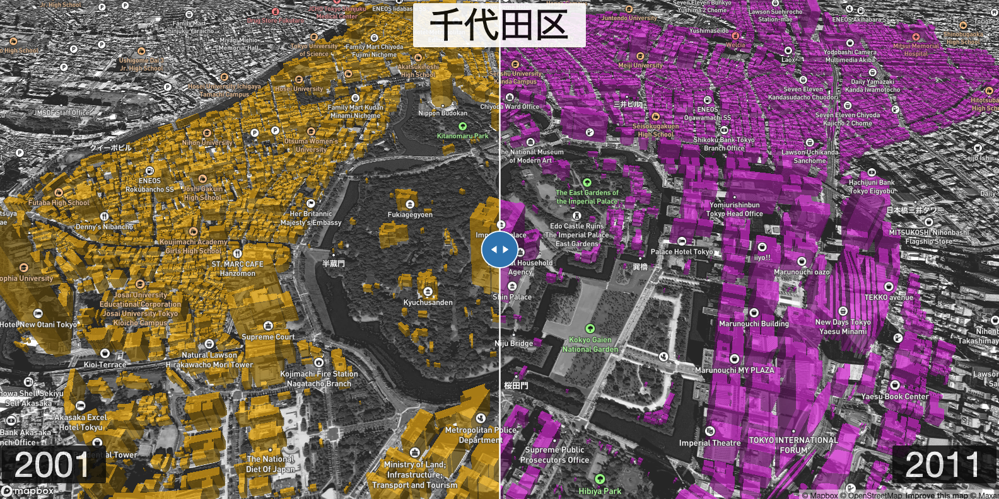

# XYMAX+Yoh
A collection of various data visualizations related to Japan's real estate situation

## 9/16/2023

- Left (yellow): 2001 buildings
- Right (purple): 2011 buildings
- Height is based on area (larger footprint = taller polygon)

[https://yohman.github.io/xymax/web/swipe.html](https://yohman.github.io/xymax/web/swipe.html)
