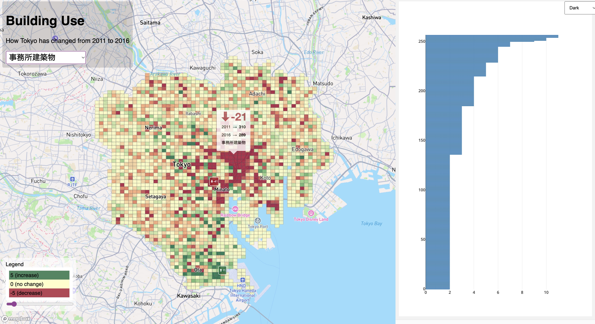
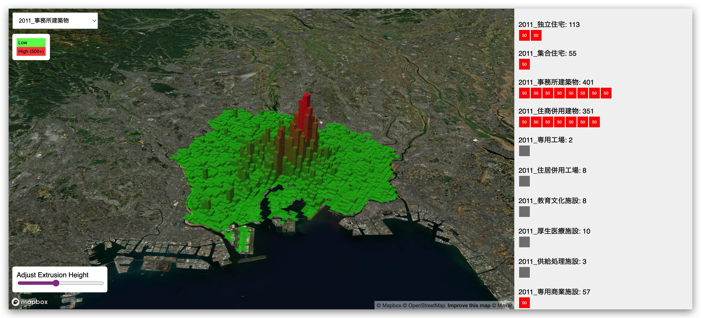

# XYMAX+Yoh

## Resources

Data

Plateau "real-time" data:

- https://www.geospatial.jp/ckan/dataset/plateau

Conversion tools gml → geojson

- https://github.com/GeoPythonJP/citygml-convert-tools
- https://ozekik.github.io/plateaukit/cli/convert/

# Log

A collection of various data visualizations related to Japan's real estate situation

## 2/13/2024
What has changed from 2011 to 2016?

[https://yohman.github.io/xymax/buildinguse_change/](https://yohman.github.io/xymax/buildinguse_change/)

## 1/15/2024

Where are different building uses located in Tokyo?

[https://yohman.github.io/xymax/buildinguse/](https://yohman.github.io/xymax/buildinguse/)

## 9/16/2023

- Left (yellow): 2001 buildings
- Right (purple): 2011 buildings
- Height is based on area (larger footprint = taller polygon)
- Swipe (left ⇔ right)

[https://yohman.github.io/xymax/web/swipe.html](https://yohman.github.io/xymax/web/swipe.html)
