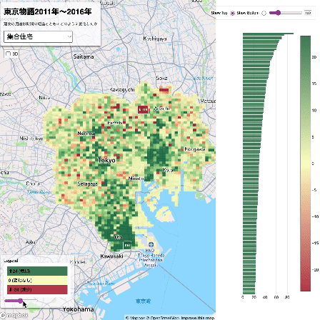
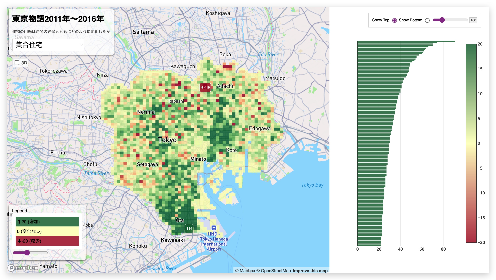

# XYMAX+Yoh

# Production Log

A collection of various data visualizations related to Japan's real estate situation

## 4/9/2024

「建物の用途は時間の経過とともにどのように変化したか。」

→ [Enter site](https://yohman.github.io/xymax/buildinguse_change/)

### Features

#### Changes from 2011 to 2016

#### Different building uses

#### 3D

#### Switch to show either top increase or decrease 

#### Change the color scale

<!-- 

 -->

→ [Enter site](https://yohman.github.io/xymax/buildinguse_change/)

## 2/16/2024

- added 3D mode
- color coded bar charts to match map bin colors

## 2/13/2024
What has changed from 2011 to 2016?

[https://yohman.github.io/xymax/buildinguse_change/](https://yohman.github.io/xymax/buildinguse_change/)

## 1/15/2024

Where are different building uses located in Tokyo?

[https://yohman.github.io/xymax/buildinguse/](https://yohman.github.io/xymax/buildinguse/)

## 9/16/2023

- Left (yellow): 2001 buildings
- Right (purple): 2011 buildings
- Height is based on area (larger footprint = taller polygon)
- Swipe (left ⇔ right)

[https://yohman.github.io/xymax/web/swipe.html](https://yohman.github.io/xymax/web/swipe.html)
